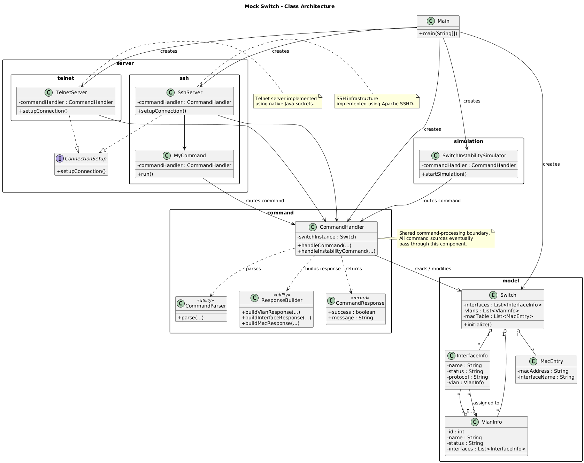

## Overview

This project is a network switch simulator developed to reproduce the
behavior of a Cisco switch in a controlled testing environment. It was
created specifically to test and validate the switch monitoring application
without requiring access to a physical Cisco switch.

The simulator implements the switch components and behaviors required by the
monitoring application, including communication through both SSH and Telnet,
as well as authentication mechanisms corresponding to those used by Cisco
switches. Telnet authentication can also be configured according to the
desired testing scenario.

A key objective of the simulator is to provide realistic and varied switch
behavior rather than simply returning predefined responses. For this reason,
the simulator includes instability logic that can modify the simulated
switch's state over time. This makes it possible to reproduce different
operational situations, such as changes in switch availability, and to test
how the monitoring application detects and handles these situations.

The simulator was therefore developed as a dedicated testing tool for the
monitoring application, allowing its communication, authentication, data
retrieval, and monitoring mechanisms to be tested under different scenarios
in a controlled and reproducible environment.
## Architecture

The simulator follows a modular architecture organized around two main
aspects: the representation of the simulated network switch and the
processing of commands used to interact with and modify its state.

The architecture is divided into several packages, with each package
grouping components according to its responsibility.

The architecture of the simulator is illustrated in the following class
diagram:



### Model Package

The `model` package contains the classes that represent the main network
components and information maintained by the simulated switch.

#### Switch

The `Switch` class represents the simulated network switch. It maintains
the VLAN information, interface information, and MAC address table associated
with the switch.

The MAC address table is represented by a list of `MacEntry` objects, where
each entry associates a MAC address with the name of the interface through
which it is reachable.

#### VlanInfo

The `VlanInfo` class represents a VLAN configured on the simulated switch.
It contains:

- The VLAN identifier.
- The VLAN name.
- The VLAN status.
- A list of `InterfaceInfo` objects representing the interfaces assigned to
  the VLAN.

#### InterfaceInfo

The `InterfaceInfo` class represents an interface of the simulated switch.
It contains the interface name, its status, its protocol state, and other
information required by the monitoring application.

The interface status is intentionally simplified to two states: `UP` and
`DOWN`. The simulator does not attempt to reproduce every possible Cisco
interface state. Instead, the states are modeled according to the scenarios
relevant to the monitoring application.

The `UP` state represents an operational interface, whether it currently has
an active connection or is operational without being connected.

The `DOWN` state represents an interface that is not operational, including
switch-related or configuration-related problems.

This simplification allows the simulator to focus on the two main scenarios
required by the monitoring application: an operational interface and an
interface affected by a switch-related problem.
#### MacEntry

The `MacEntry` class represents an entry in the simulated switch's MAC
address table. It contains two pieces of information:

- `macAddress`: The MAC address associated with the entry.
- `interfaceName`: The name of the switch interface associated with that
  MAC address.

This class is used to represent the association between a MAC address and
the interface through which it is reachable.

### Command Package

The `command` package contains the components responsible for interpreting,
processing, and generating responses to commands.

#### CommandHandler

The `CommandHandler` is responsible for the command routing logic. It
receives a command from an external client and routes it to the appropriate
method responsible for processing that command.

The handler has an association with the `Switch` object, allowing it to
retrieve information from the simulated switch or modify its internal state.

Commands can therefore be used to retrieve information such as:

- Interface status.
- VLAN information.
- MAC address table entries.

The handler also supports commands specifically designed to modify the
state of the simulated switch. These commands are used to reproduce
different testing scenarios, such as making an interface unavailable or
changing the state of a network component in order to simulate instability.

#### CommandParser

The `CommandParser` is responsible for extracting parameters from the
custom commands used to modify the internal state of the simulated switch.

For example, it can extract information such as a VLAN identifier,
interface name, or other parameters required to execute a state-changing
command.

Separating the parsing logic from the command handling logic keeps the
command processing more organized and makes it easier to introduce
additional custom commands.

#### ResponseBuilder

The `ResponseBuilder` is a utility class composed exclusively of static
methods. Its purpose is to transform the internal model objects into
responses formatted like those returned by a Cisco switch.

It can, for example, transform `VlanInfo`, `InterfaceInfo`, and MAC address
information into switch-like command output.

This allows the monitoring application to interact with the simulator using
responses that closely reproduce the format of a real Cisco switch.

#### CommandResponse

The `CommandResponse` is a record used to represent the result of a
state-changing command.

It communicates whether the requested operation was successfully executed
and, when it fails, provides information about the reason for the failure.

For example, a command may fail because:

- The specified VLAN does not exist.
- The specified interface does not exist.
- The requested interface state is already the current state.

The resulting response can then be used by the simulator to log or display
the outcome of the command, making it clear whether the requested operation
was executed successfully or why it could not be performed.
### Server Package

The `server` package contains the components responsible for establishing
and managing client connections through the supported communication protocols:
SSH and Telnet.

Both protocol implementations follow the same abstraction through the
`ConnectionSetup` interface. Each server implements this interface and
provides its own implementation of the `setupConnection()` method according
to the requirements of its protocol.

This separation allows the rest of the simulator to remain independent of
the underlying communication protocol.

#### ConnectionSetup

The `ConnectionSetup` interface defines the common contract for establishing
a server connection. Its main responsibility is to provide the
`setupConnection()` method, which is implemented independently by the SSH
and Telnet servers.

#### SSH Package

The `ssh` package contains the implementation responsible for providing an
SSH server.

##### SSHServer

The `SSHServer` class implements the `ConnectionSetup` interface and
overrides the `setupConnection()` method to initialize the infrastructure
required to run an SSH server.

The SSH server listens on port `22` and defines the credentials required to
authenticate clients connecting to the simulated switch.

The SSH infrastructure is built using the Apache SSHD Mina library, which
provides the underlying SSH server implementation.

##### MyCommand

The `MyCommand` class is an infrastructure-level component required by the
Apache SSHD Mina library. Its role is to bridge the SSH infrastructure with
the simulator's application-level command processing.

When a command is received through the SSH server, `MyCommand` forwards it to
the `CommandHandler`, which then determines how the command should be
processed.

This separation prevents the protocol-specific infrastructure from being
directly responsible for the simulator's business logic.

#### Telnet Package

The `telnet` package contains the implementation responsible for providing
a Telnet server.

Unlike SSH, no suitable server-side library was used for the Telnet
implementation. Therefore, the Telnet server was implemented directly in
Java using the standard socket API.

##### TelnetServer

The `TelnetServer` creates a server socket that listens on port `23` for
incoming Telnet connections.

Whenever a client establishes a connection, the server creates a dedicated
thread to handle that client session. The lifecycle of the Telnet session is
therefore associated with the lifecycle of its corresponding thread.

The Telnet protocol behavior required by the simulator is implemented
directly in Java. This includes the connection and authentication sequence,
the command prompt, command processing, and the responses returned to the
client.

The server is designed to reproduce the behavior expected from a Cisco
switch during a Telnet session, including both successful responses and
failure scenarios.

After receiving a command, the Telnet server forwards it to the simulator's
command-processing components, allowing the same application-level logic to
be used independently of the communication protocol.
### Simulation Package

The `simulation` package contains the components responsible for controlling
the simulator locally and for initializing all of its services.

#### SwitchInstabilitySimulator

The `SwitchInstabilitySimulator` is responsible for providing an interactive
way to modify the internal state of the simulated switch.

It creates a `Scanner` connected to the standard input and continuously waits
for commands entered by the user. Each command is then forwarded to the
`CommandHandler`, in the same way that commands received through SSH are
forwarded by the `MyCommand` component.

This component is mainly intended to manually reproduce different switch
conditions during testing, such as changing the state of an interface or
triggering other instability scenarios.

The simulator continuously waits for user input until the application is
terminated.

#### Main Initialization

The `main` method is responsible only for initializing and starting the
different components of the simulator.

#### Main Initialization

The `main` method is responsible for initializing and starting all components
required by the simulator.

The initialization process begins by creating a `Switch` instance. The
`initialize()` method of the switch is then called to populate it with an
initial state instead of starting with an empty configuration. This initial
state contains the required interface information, VLAN information, and MAC
address entries. The different objects are initialized and associated with
each other according to the structure of the simulated switch.

Once the switch has been initialized, a `CommandHandler` is created and the
`Switch` instance is injected into it. The command handler therefore has
access to the complete internal state of the simulated switch and can both
retrieve information from it and modify its state.

The SSH and Telnet servers are then instantiated. The shared
`CommandHandler` is injected into both servers so that commands received
through either protocol can be forwarded to the same command-processing
logic. The `setupConnection()` method is then called on each server to
initialize their respective communication infrastructure.

The `SwitchInstabilitySimulator` is also instantiated with access to the
same `CommandHandler`. It therefore uses the same command-processing logic
as external SSH and Telnet clients when manually modifying the state of the
simulated switch.

Finally, the three active components are started in separate threads:

- The SSH server runs in its own thread.
- The Telnet server runs in its own thread.
- The `SwitchInstabilitySimulator` runs in its own thread.

This concurrent execution allows the simulator to accept SSH and Telnet
connections while simultaneously allowing the user to manually trigger
state changes through the instability simulator.
### Command Handler Synchronization

The `CommandHandler` is shared by the SSH server, the Telnet server, and the
`SwitchInstabilitySimulator`. Since these components can access the same
`Switch` object concurrently, the methods responsible for reading or
modifying the switch state are synchronized.

This synchronization ensures that a state-changing operation cannot occur
while another operation is reading the same state. Without this protection,
a client could retrieve information while the switch is being modified and
receive an inconsistent or partially updated state.

Similarly, concurrent commands that modify the switch are serialized to
prevent conflicting operations from modifying the shared state at the same
time.

The `CommandHandler` therefore acts as the synchronization point between all
command sources and the shared switch model, ensuring consistent access to
the simulated switch state.
## Technologies Used

| Technology / Library | Version | Purpose |
|----------------------|---------|---------|
| Java | 21 | Main programming language used to develop the simulator |
| Maven | 3.9.9 | Project build and dependency management |
| Apache SSHD | 2.13.2 | Provides the SSH server infrastructure |
| Apache MINA | 2.13.2 | Provides the transport layer used by Apache SSHD |
| Java Sockets | — | Used to implement the Telnet server natively |

## Instability Simulation Commands

The simulator provides a set of custom commands specifically developed to
manually modify the state of the simulated switch and reproduce various
instability scenarios.

These commands are not Cisco IOS commands. They are custom commands created
for testing purposes and allow the user to modify interfaces, VLANs, and MAC
address associations during runtime.

### Interface Commands

| Command | Description |
|---------|-------------|
| `DOWN interface {name}` | Brings the specified interface down. |
| `UP interface {name}` | Brings the specified interface back up. |
| `CREATE interface {name} TO {vlan_id}` | Creates a new interface and assigns it to the specified VLAN. |
| `DELETE interface {name}` | Deletes the specified interface. |

### VLAN Commands

| Command | Description |
|---------|-------------|
| `DOWN vlan {name}` | Deactivates the specified VLAN. |
| `UP vlan {name}` | Reactivates the specified VLAN. |
| `CREATE vlan {name}` | Creates a new VLAN. |
| `DELETE vlan {id}` | Deletes the specified VLAN. |

### VLAN Assignment Commands

| Command | Description |
|---------|-------------|
| `ASSIGN {interface} TO {vlan}` | Assigns the specified interface to a VLAN. |

### MAC Address Commands

| Command | Description |
|---------|-------------|
| `ASSIGN MAC {mac} TO {interface}` | Associates a MAC address with the specified interface. |
| `UNASSIGN MAC {mac} FROM {interface}` | Removes the MAC address association from the specified interface. | 

### Help Command

The `HELP` command displays all commands available in the simulator, making
it easier for the user to discover and use its different features.

```text
HELP
```

### Cisco Commands

The simulator also provides three Cisco commands to display the current state
of the simulated switch:

| Command | Description |
|---------|-------------|
| `show vlan brief` | Displays the VLANs configured on the switch, including their IDs and names. |
| `show interface status` | Displays the interfaces and their current status and information. |
| `show mac address-table` | Displays the MAC address table and the interfaces associated with each MAC address. |

These commands allow the user to inspect the current state of the switch and
identify the VLAN names, VLAN IDs, and interface names required when using
the custom commands to modify the switch state.

